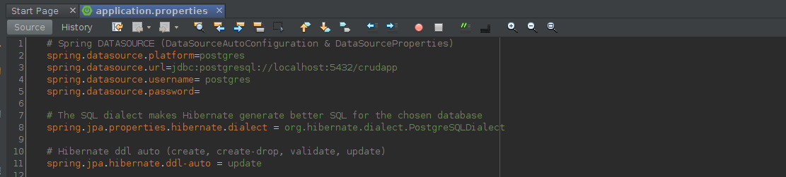

# Spring Boot Back-End

This project was generated with Gradle version 5.2.1.

## Ejecutar el siguiente Scritp en la db postgresql 

CREATE DATABASE crudapp;

CREATE TABLE flightreserva
(
  id int NOT NULL,
  firstname character varying(255),
  lastname character varying(255),
  flightplace character varying(255),
  flightdate character varying(255),
  createdAt TIMESTAMP DEFAULT CURRENT_TIMESTAMP,
  status character varying (255) DEFAULT 'New'
  updatedAt TIMESTAMP,	 	  
  CONSTRAINT flireserva_pkey PRIMARY KEY (id)
);

## Agregar la credenciales de la DB postgresl

## Running

Ejectar el proyecto
